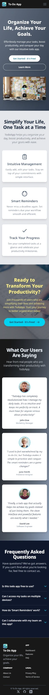

# 🚀 Pro-Todo: Full-Stack Task Manager (Vue.js, Laravel API & GSAP)

---

### 📝 Project Overview

This Pro-Todo application masterfully balances robust security and exceptional, yet inherently simple, user experience (UX), driven by advanced GSAP animation techniques.

#### Backend & Security

The backend is built upon **Laravel**, providing a powerful **RESTful API**. Security is prioritized using **Laravel Sanctum** for **token-based authentication**, ensuring that all task management operations (CRUD) are secure and tied strictly to the authenticated user.

#### Frontend & Dynamic UX

The frontend leverages **Vue.js 3** with ٰComposition API to deliver a fast and reactive Single Page Application (SPA).

* **Tailwind CSS:** Used for a modern, utility-first design approach, resulting in a clean and highly responsive user interface.
* **GSAP Magic:** To elevate the UX beyond typical To-Do applications, **GSAP (GreenSock Animation Platform)** is utilized:
    * **SplitText & Transitions:** Enables smooth, micro-animations for task entry, status changes, and title displays, making the application feel fluid and professional.
    * **ScrollTrigger:** (If used) Used to create dynamic, scroll-linked visual effects, further enhancing user engagement.

---

### 🌟 Key Features

* **Comprehensive Task Management (CRUD):** Full functionality to Create, Read, Update, and Delete tasks.
* **Task Status Toggle:** Seamlessly mark tasks as completed or pending.
* **Secure User Authentication:** Robust sign-up and login features protected by **Laravel Sanctum**.
* **Interactive Design:** Enhanced visual feedback and interaction using advanced GSAP animations.
* **Fully Responsive:** Optimized UI for desktop, tablet, and mobile viewing.
* **Efficient Task Sorting & Filtering:** Users can **sort** tasks (e.g., by creation date or status) and **filter** the list for enhanced productivity.

---

### 🛠️ Technology Stack

This project is a showcase of modern full-stack development skills:

| Category | Technology | Purpose |
| :--- | :--- | :--- |
| **Frontend** | **Vue.js 3** | Main framework for the Single Page Application (SPA). |
| **Styling** | **Tailwind CSS** | Utility-First framework for modern, highly responsive design. |
| **Animation Core** | **GSAP (GreenSock)** | Professional library for high-performance, smooth animations. |
| **Animation Modules** | **SplitText, ScrollTrigger** | Specialized modules for text and scroll-based effects. |
| **Backend API** | **Laravel** | PHP Framework providing the robust RESTful API endpoints. |
| **Authentication** | **Laravel Sanctum** | Lightweight system for token-based API authentication. |
| **Database** | **MySQL** |

---

### 🖼️ Showcase & Screenshots

  
  

  

